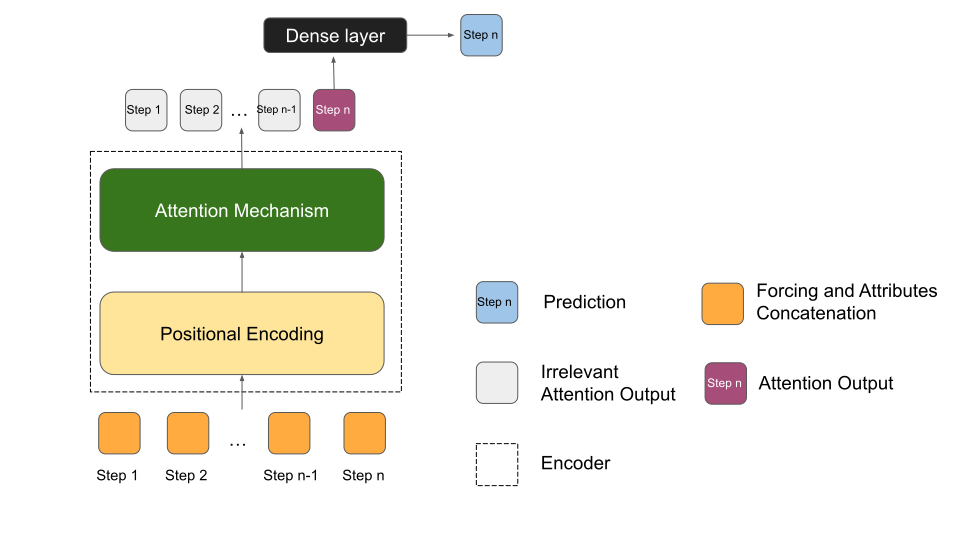

Machine learning has achieved great remarkble achievement in the field of hydrology

This repository is based on [NeuralHydrology](https://github.com/neuralhydrology/neuralhydrology) and has incorporated several [Transformer](https://arxiv.org/abs/1706.03762) models and [Timestamp Positional Encoding method](https://arxiv.org/abs/2012.07436). The Transformer models include [Reformer](https://arxiv.org/abs/2001.04451), [Informer](https://arxiv.org/abs/2012.07436), [Linformer](https://arxiv.org/abs/2006.04768), and [FEDformer](https://arxiv.org/abs/2201.12740), which were introduced in recent years to address the issues with the original Transformer in time series prediction problems. 

# Transformers for Hydrological modeling
In a deep learning-based hydrological model, the discharge at a particular time step is a function of the meteorological forcing observed over the past n time steps. Therefore, compared to the original Transformer architecture, the Transformer used for hydrological modeling only needs the Encoder part.

Some Transformer variants has been added into the NeuralHydrology.

## Reformer
The detailed descriptions about the arguments of Reformer are as following:

| Hyperparameter name | Description of parameter |
| --- | --- |
| reformer_layers           | Number of reformer encoder layers (defaults to 2).                           |
| reformer_nheads      | Number of attention heads (defaults to 2).    |
| reformer_bucket_size      | Nash bucket size (defaults to 16).                  |
| reformer_n_hashes      |  Number of hash (defaults to 4).               |
| reformer_dropout      | Reformer dropout (defaults to 0.1).  |

## Informer
The detailed descriptions about the arguments of Informer are as following:
| Hyperparameter name | Description of parameter |
| --- | --- |
| informer_n_layers           | Number of encoder layers (defaults to 2).       |
| informer_n_heads      | Number of heads (defaults to 4).  |
| informer_distil      | Whether to use distilling in encoder, using this argument means not using distilling (defaults to `True`).                  |
| informer_factor      | Probsparse attn factor (defaults to 5).             |
| informer_activation      | Activation function (defaults to `gelu`).  |

## FEDformer
The detailed descriptions about the arguments of FEDformer are as following:
| Hyperparameter name | Description of parameter |
| --- | --- |
| fedformer_version           | Two subversionstructures for signal process, can be `Wavelets` or `Fourier`. |
| fedformer_base      | Wavelet orthogonal polynomials, can be `legendre` or `chebyshev`. |
| fedformer_mode_select      | Mode select method, can be `random` or `not`.  |
| fedformer_nheads      | Number of attention heads (defaults to 8).  |
| fedformer_e_layers      | Number of FEDformer encoder layers (defaults to 2).    |
| fedformer_d_layers      | Number of FEDformer decoder layers (defaults to 1).  |
| fedformer_factor      | Probsparse attn factor (defaults to 1).  |
| fedformer_modes      | Number of modes (defaults to 32).  |

## Linformer
The detailed descriptions about the arguments of FEDformer are as following:
| Hyperparameter name | Description of parameter |
| --- | --- |
| linformer_n_layers           | Number of Linformer encoder layers (defaults to 2).                                             |
| linformer_n_heads      | number of Linformer heads (defaults to 2).    |

# Cite

In case you use any Transformer models in your research or work, it would be highly appreciated if you cite this repository.

# Contact

For questions or comments regarding the usage of this repository, please use the [discussion section](https://github.com/neuralhydrology/neuralhydrology/discussions) on Github. For bug reports and feature requests, please open an [issue](https://github.com/neuralhydrology/neuralhydrology/issues) on GitHub.
In special cases, you can also reach out to us by email: neuralhydrology(at)googlegroups.com

# Recommendation

According to our results from the [CAMELS](https://ral.ucar.edu/solutions/products/camels) experiment, the Reformer model with time feature positional encoding performed well in simulating the rainfall-runoff relationship in snow-driven basins (major precipitation form is snow), even outperforming LSTM. Therefore, if you are looking to do hydrological modeling in a snow-driven catchment, the Reformer model may be worth considering.
